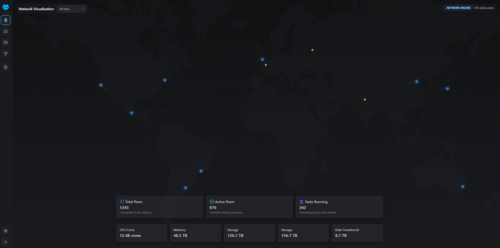

# CatP2P

> "The most powerful computer in the world is everyone's computer combined."

CatP2P is building the foundation for democratizing computing power. By connecting devices across the globe into a seamless peer-to-peer network, we're unlocking the untapped potential of millions of computers sitting idle.

A high-performance peer-to-peer library for distributed computing, written in Rust.

## Features

- **P2P Networking**: Built on libp2p for robust peer discovery and communication
- **Task Distribution**: Efficiently distribute and execute tasks across the network
- **Resource Management**: Monitor and allocate CPU, GPU, memory, and storage resources
- **Benchmarking**: Assess node capabilities for optimal task allocation
- **Local Storage**: Persistent storage for task logs and peer interactions
- **Scoring System**: Track contributions and allocate rewards



*Screenshot of an application built on CatP2P, visualizing a global peer-to-peer network. The world map displays node distribution and real-time connection data, demonstrating the library's capabilities for building powerful distributed systems that span continents. This visualization showcases how CatP2P enables applications to harness computing resources across geographical boundaries.*

## Documentation

For detailed documentation, visit our [documentation site](https://johnnyvillas.github.io/catp2p/).

## Getting Started

### Installation

Add catp2p to your Cargo.toml:

```toml
[dependencies]
catp2p = "0.1.0"
```

### Basic Usage

```rust
use catp2p::CatP2P;

fn main() -> Result<(), Box<dyn std::error::Error>> {
    // Create a new CatP2P instance with default configuration
    let mut node = CatP2P::new()?;
    
    // Start the node
    node.start()?;
    
    // The node is now running and will discover peers and process tasks
    
    // When done, stop the node
    node.stop()?;
    
    Ok(())
}
```

## Configuration

catp2p can be configured with different resource modes:

```rust
use catp2p::{CatP2P, config::{Config, ResourceMode}};

fn main() -> Result<(), Box<dyn std::error::Error>> {
    // Create a custom configuration
    let mut config = Config::default();
    config.resource_mode = ResourceMode::HighPerformance;
    
    // Create a CatP2P instance with custom configuration
    let mut node = CatP2P::with_config(config)?;
    
    // Start the node
    node.start()?;
    
    Ok(())
}
```

## Next Steps

1. **Create the repository structure**:
   ```bash
   mkdir -p catp2p/src/{network,tasks,resources,storage,benchmark,scoring}
   mkdir -p catp2p/{examples,benches,tests,docs/{api,guides}}
   ```

2. **Initialize the Git repository**:
   ```bash
   cd catp2p
   git init
   ```

3. **Create the initial files** as outlined above.

4. **Add a .gitignore file**:
   ```bash
   echo "/target/" > .gitignore
   echo "Cargo.lock" >> .gitignore
   ```

## License

This project is licensed under the Apache License 2.0. See the [LICENSE](./LICENSE) file for details.

## Our Vision

We believe computing resources should be accessible to everyone, not just those with access to expensive infrastructure. By joining the CatP2P network, you're helping build a more equitable digital future where anyone can access the computational power they need.

### Join the Movement

Whether you're a developer looking to contribute code, a user willing to share your idle computing resources, or an organization with computational needs, there's a place for you in the CatP2P ecosystem.

- 🌐 Share your unused computing power
- 🚀 Access distributed computing when you need it
- 🔧 Help build the infrastructure of tomorrow

Together, we can create a more resilient, accessible, and democratic computing landscape.
